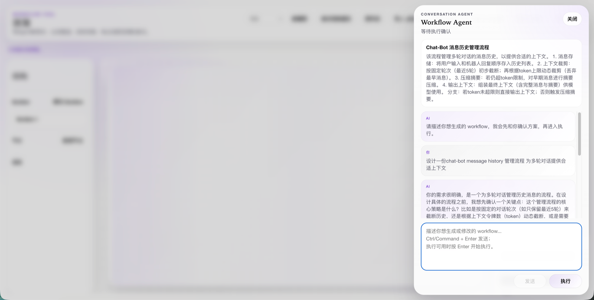
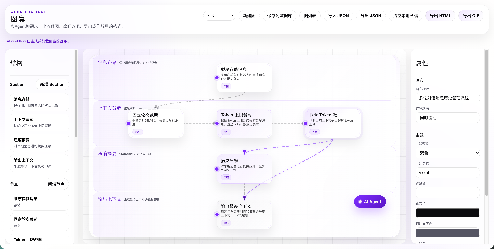

# 图舅 / UncleFlow

> Uncle不老，但也不是小年轻了。  
> 这是一个“老登”风格的项目——比如GIF导出功能就是为贴进PPT而量身定做，支持手动微调节点位置、大小等操作, 以弥补当前AI画歪的问题。不过，这些功能可能等AI再发展几个月后就变成浮云了。  
>  
> 你可以创建和编辑自己的工作流，最好搭配一个大模型（没有也能用，但既然没有，何不用别家项目呢？）。

使用流程：

1. 和Agent聊需求
2. AI帮你画出流程图
3. 你手动改吧改吧
4. 导出成你想要的格式

> 聊需求
 
> 生成流程图
 


## 快速启动

环境变量统一放在项目根目录 `.env`。

```bash
cp .env.example .env
cd app
```

数据库类型只由根目录 `.env` 中的 `STORAGE_DRIVER=sqlite|postgres` 决定。

```bash
npm run db:migrate       # 按 STORAGE_DRIVER 执行迁移
npm run dev              # 启动后端 + Vite
npm run frontend         # 仅启动 Vite，模式由 VITE_* 环境变量决定
```

**Docker 启动：**

```bash
docker compose up --build -d                           # SQLite（默认）
COMPOSE_PROFILES=pg docker compose up --build -d        # PostgreSQL
COMPOSE_PROFILES=front-only docker compose up --build -d # 仅前端
```

> 详细说明见 [开发与部署文档](dev_docs/development.md)。

## AI Agent 配置

项目使用 OpenAI SDK，但请配置 DeepSeek 模型，因为使用了对话前缀续写特性。
在 `.env` 中配置：


```bash
OPENAI_API_KEY=sk-xxx
DEFAULT_MODEL_NAME=deepseek-v4-flash
OPENAI_API_BASE=https://api.deepseek.com
```

> 详细配置（FIM Completion、/beta 端点、双 client 架构等）见 [技术架构文档](dev_docs/architecture.md)。

## Makefile 快捷命令

```bash
make help              # 查看所有可用目标
make install           # 安装依赖
make dev               # 启动后端 + Vite
make frontend          # 仅启动 Vite
make server            # 启动后端
make server-dev        # 启动后端 (watch 模式)
make migrate           # 按 STORAGE_DRIVER 执行迁移
make build             # 类型检查并构建
make lint              # 运行 ESLint
make test              # 运行测试
make preview           # 预览生产构建
```

## 验证

```bash
cd app
npm run test
npm run lint
npm run build
```

## 更多文档

- [技术架构](dev_docs/architecture.md)：目录结构、AI Agent 详细配置、GIF 导出
- [开发与部署](dev_docs/development.md)：环境配置、开发命令、Docker 部署
- [代码优化计划](dev_docs/code_optimization_plan.md)：当前代码热点、分阶段重构顺序、验收标准
